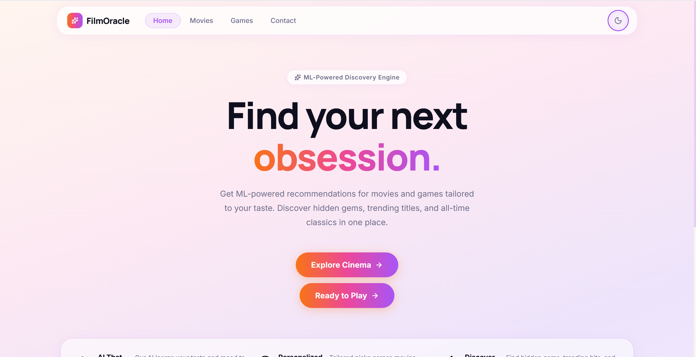
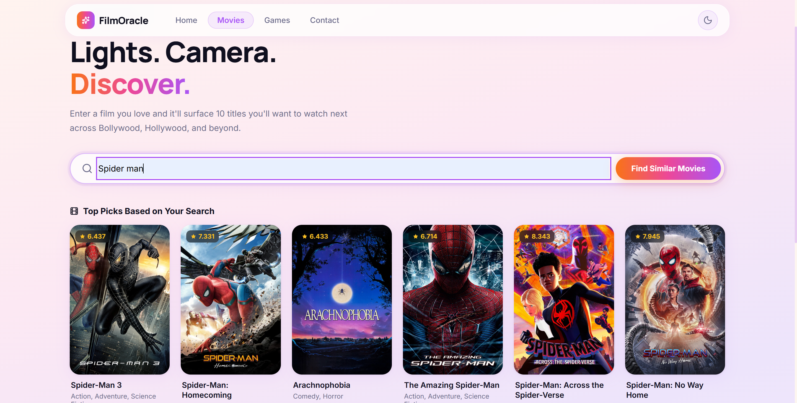
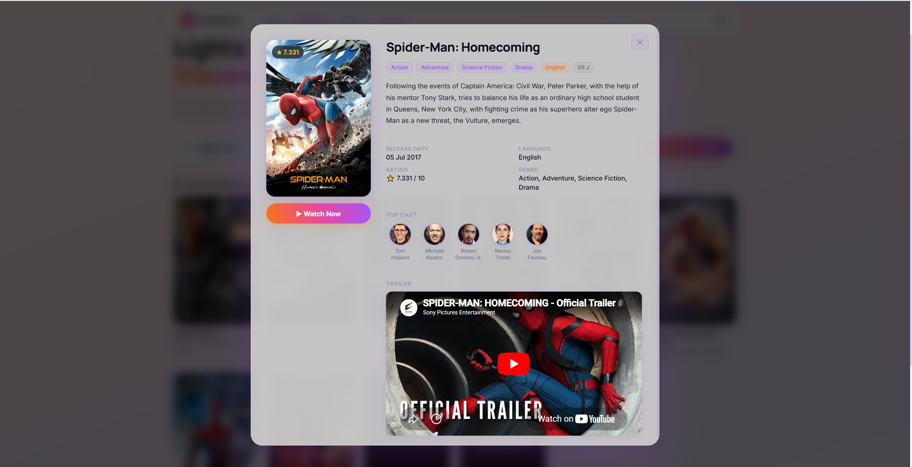
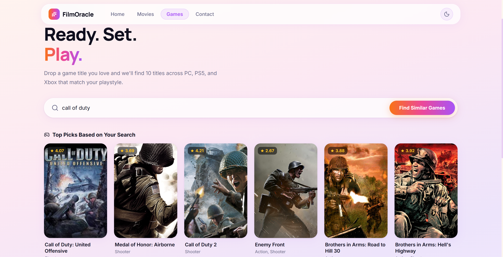
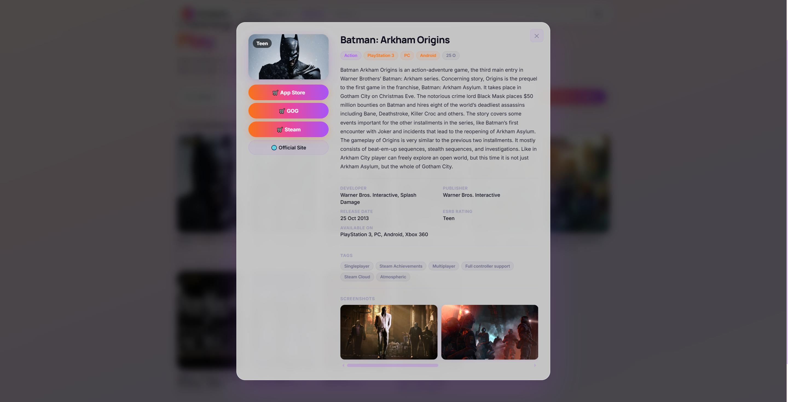

# 🎬 FilmOracle

<div align="center">

# Find Your Next Obsession.

**ML-Powered Entertainment Recommendation Platform**

FilmOracle is a ML-powered entertainment recommendation platform that helps users discover their next favorite **movies** and **games** using Machine Learning based **content-based filtering** and **cosine similarity**.

Built with a production-ready **FastAPI + React (Vite)** architecture, FilmOracle showcases clean software engineering practices, modular backend design, and an elegant user experience.


</div>

---

# ✨ Features

- 🎬 Movie Recommendation Engine
- 🎮 Game Recommendation Engine
- ⚡ Lightning-fast recommendations using TF-IDF + Cosine Similarity
- 🔎 Smart title search
- 🎭 Rich Movie Details Modal
- 🕹 Rich Game Details Modal
- ▶ Embedded trailers
- 🛒 Game store links
- 📱 Responsive modern UI
- 🌙 Light/Dark mode
- 📩 WhatsApp Contact Form
- 🐳 Docker Ready
- 🚀 Vercel + Render Deployment

---

# 🖼 Application Preview

## 🏠 Home



---

## 🎬 Movies



---

## 🎬 Movie Details



---

## 🎮 Games



---

## 🎮 Game Details



---

## 📩 Contact


---

# 🏗 Architecture

```text
                    FilmOracle

              React + Vite Frontend
                      │
                      ▼
                 FastAPI REST API
                      │
        ┌─────────────┴─────────────┐
        ▼                           ▼
 Recommendation Service      Contact Service
        │
        ▼
 Recommendation Engine
        │
        ▼
 TF-IDF Vectorizer
        │
        ▼
 Cosine Similarity Matrix
        │
        ▼
 Movie/Game Dataset
```

---

# 🔄 Recommendation Pipeline

```text
User Search
      │
      ▼
Title Validation
      │
      ▼
Alias Resolution
      │
      ▼
Dataset Lookup
      │
      ▼
Cosine Similarity
      │
      ▼
Top 10 Recommendations
      │
      ▼
Metadata Enrichment
      │
      ▼
API Response
      │
      ▼
React UI
```

---

# 🛠 Tech Stack

| Layer | Technologies |
|-------|--------------|
| Frontend | React, Vite, CSS |
| Backend | FastAPI |
| Recommendation | TF-IDF, Cosine Similarity |
| Language | Python |
| Deployment | Docker, Render, Vercel |

---

# 📚 Documentation

Detailed project documentation is available inside the **docs/** folder.

- ARCHITECTURE.md
- API.md
- SETUP.md
- DEPLOYMENT.md

---

# 🗺 Roadmap

## Completed

- Modern React UI
- FastAPI Backend
- Movie Recommendation Engine
- Game Recommendation Engine
- Rich Detail Modals
- Docker Support
- Production Folder Structure

## Planned

- User Accounts
- Personalized Recommendations
- Mood-based Recommendations
- LLM Integration
- Vector Search
- Watchlists
- Recommendation History
- Analytics Dashboard

---

# 💼 Why FilmOracle?

FilmOracle is more than a recommendation engine.

It demonstrates:

- Production-grade backend architecture
- REST API development
- Recommendation Systems
- Machine Learning application
- Frontend engineering
- Deployment workflows
- Software architecture best practices

---

# 📄 License

Licensed under the MIT License.

Built with ❤️ by **Hoshang Sheth**
